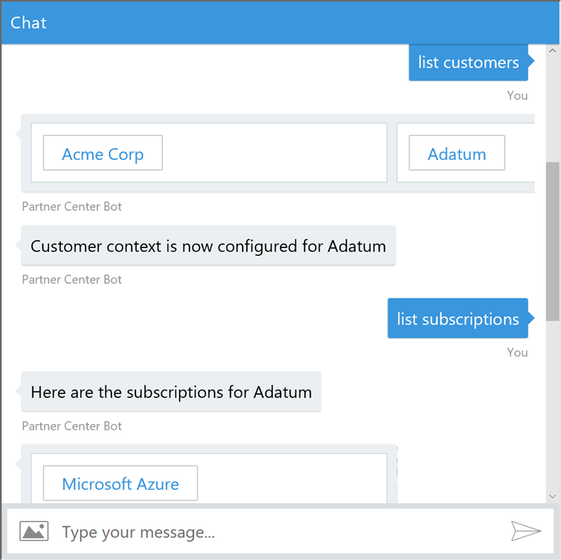
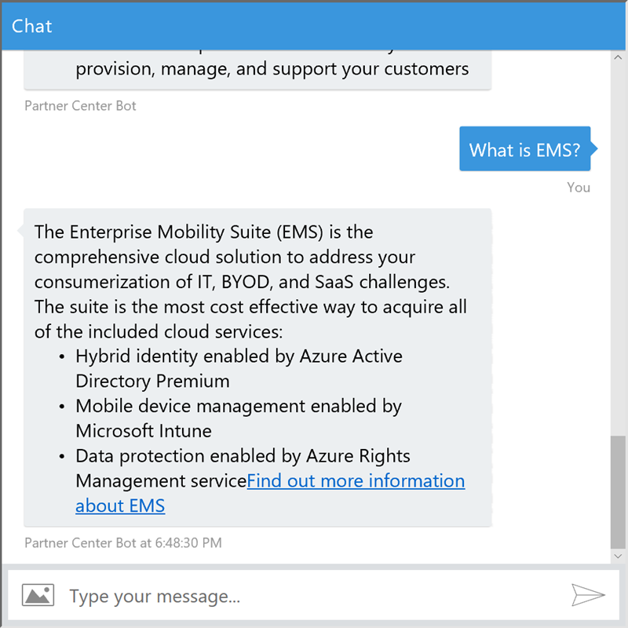

# Partner Center Bot
This is a sample project that demonstrates how to leverage the Microsoft Bot framework to construct a bot that interacts with Partner Center. With this initial release limited
features are supported. Additional abilities will be added over time. The intent of this project is not to provide a fully functional bot, but rather to demonstrate how this 
technology can be utilize to support customers. Most customers want the ability to resolve issues on their own, and this sample provides you a tool that can help fulfill that
desire.

This project is being provided with community support only. If you need help please
log an issue using the [issue tracker](https://github.com/Microsoft/Partner-Center-Bot/issues).

__Current Build Status:__ 

## Features 
Currently this project has the ability to list customers, select a specific customer, and list the subscriptions for that particular customer. 

In addition to integrating with Partner Center the bot integrates with the [QnA Maker](docs/QnAMaker.md) cognitive service.
This makes it where the user can get answers to commonly asked questions.  

## Deployment
Please review the [Deployment](docs/Deployment.md) guide for details on how to deploy this solution.

## Code of Conduct 
This project has adopted the [Microsoft Open Source Code of Conduct](https://opensource.microsoft.com/codeofconduct/). For more 
information see the [Code of Conduct FAQ](https://opensource.microsoft.com/codeofconduct/faq/) or contact 
[opencode@microsoft.com](mailto:opencode@microsoft.com) with any additional questions or comments.

## License
Copyright (c) Microsoft Corporation. All rights reserved.

Licensed under the [MIT](LICENSE) License.