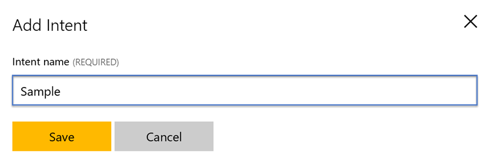

# Adding New Intents
The [Language Understanding Intelligent Service (LUIS)](http://luis.ai) provides the ability to process conversational information 
and extract an intent from that information. This ability enables us to map sentences received to a particular function defined with in the 
[_ActionDialog_](https://github.com/Microsoft/Partner-Center-Bot/blob/master/src/Bot/Dialogs/ActionDialog.cs) class. As an example if an authenticated 
user sends _list customers_ this will be processed by LUIS and eventually mapped to the [_ExecuteAsync_](https://github.com/Microsoft/Partner-Center-Bot/blob/master/src/Bot/Intents/ListCustomersIntent.cs#L61)
function defined in the [_ListCustomerIntnent_](https://github.com/Microsoft/Partner-Center-Bot/blob/master/src/Bot/Intents/ListCustomersIntent.cs) class.

## How Are Intents Mapped? 
Before we walkthrough the process to add a new intent it is important to understand how everything is connected. When a message is received by the bot it is processed 
the [_MessageReceived_](https://github.com/Microsoft/Partner-Center-Bot/blob/master/src/Bot/Dialogs/ActionDialog.cs#L146) function in the [_ActionDialog_](https://github.com/Microsoft/Partner-Center-Bot/blob/master/src/Bot/Dialogs/ActionDialog.cs)
class. If the message received equals _login_ then the authentication workflow will be invoked, or if it is _help_ then the [_HelpAsync_](https://github.com/Microsoft/Partner-Center-Bot/blob/master/src/Bot/Dialogs/ActionDialog.cs#L55)
function will be invoked. Otherwise, it will be sent to LUIS which will extract the intent from the message. The response from LUIS will be processed by the [_RouteIntentAsync_](https://github.com/Microsoft/Partner-Center-Bot/blob/master/src/Bot/Dialogs/ActionDialog.cs#L104)
function.

The following logic is utilized to properly route the intent to the appropriate _ExecuteAsync_ function.

```csharp
key = result.TopScoringIntent.Intent.ToCamelCase();

principal = await context.GetCustomerPrincipalAsync(this.service);

if (principal == null)
{
    await this.HelpAsync(context);
    return;
}

if (principal.AvailableIntents.ContainsKey(key))
{
    await principal.AvailableIntents[key]
        .ExecuteAsync(context, message, result, this.service);
}
else
{
    await this.HelpAsync(context);
}
```

First the code will verify that the user has successfully authenticated. This is accomplished by extracting the [_CustomerPrincipal_](https://github.com/Microsoft/Partner-Center-Bot/blob/master/src/Bot/Security/CustomerPrincipal.cs)
from the private conversation data. If that object is not present in the private conversation data that means the user has not authenticated. Second the code will verify the intent exists in the dictionary of available intents for the 
authenticated user. The dictionary of availalbe intents is generated in the [_GetCustomerPrincipalAsync_](https://github.com/Microsoft/Partner-Center-Bot/blob/master/src/Bot/Controllers/OAuthCallbackController.cs#L191) function 
defined in the [_OAuthCallbackController_](https://github.com/Microsoft/Partner-Center-Bot/blob/master/src/Bot/Controllers/OAuthCallbackController.cs#L191) class.

```csharp
AvailableIntents = (from intent in this.Service.Intent.Intents
                    let roleList = Permissions.GetRoles(intent.Value.Permissions)
                    from r in roleList
                    where roles.SingleOrDefault(x => x.DisplayName.Equals(r)) != null
                    select intent).Distinct().ToDictionary(intent => intent.Key, intent => intent.Value)
```

This LINQ statement will create a dictionary that contains a reference to classes that implement the [_IIntent_](https://github.com/Microsoft/Partner-Center-Bot/blob/master/src/Bot/Intents/IIntent.cs) interface where the user has the appropriate privileges.

## Creating A New Intent
New intents will need to be defined within the LUIS application and then through code. Perform the following tasksto create a new intent within LUIS

1. Login into the [LUIS portal](http://luis.ai) and import the [_Partner-Center-Bot_](https://github.com/Microsoft/Partner-Center-Bot/blob/master/Partner-Center-Bot.json) application if you have not already
2. Select the _Partner-Center-Bot_ application and then click the _Intents_ link found on the left hand size of the dashboard
3. Click the _Add Intent_ button and then specify an appropriate name and then click _Save_

    

4. Specify various utterances that should be mapped to this intent and then click _Save_

    

If you would like to learn more about the various configurations then check out [_Add Intents_](https://github.com/Microsoft/Cognitive-Documentation/blob/master/Content/en-us/LUIS/Add-intents.md) from the LUIS documentation. Next you will need add a new class to the [_Intent_](https://github.com/Microsoft/Partner-Center-Bot/tree/master/src/Bot/Intents) directory that implements the 
[_IIntent_](https://github.com/Microsoft/Partner-Center-Bot/blob/master/src/Bot/Intents/IIntent.cs) interface. By doing this all of the required functions and properties will 
be defined. The following code is a sample of what the new intent should look like.  

```csharp
// -----------------------------------------------------------------------
// <copyright file="SampleIntent.cs" company="Microsoft">
//     Copyright (c) Microsoft Corporation. All rights reserved.
// </copyright>
// -----------------------------------------------------------------------

namespace Microsoft.Store.PartnerCenter.Bot.Intents
{
    using System;
    using System.Collections.Generic;
    using System.Threading.Tasks;
    using Logic;
    using Microsoft.Bot.Builder.Dialogs;
    using Microsoft.Bot.Builder.Luis;
    using Microsoft.Bot.Builder.Luis.Models;
    using Microsoft.Bot.Connector;
    using Security;

    /// <summary>
    /// Processes the sample intent.
    /// </summary>
    /// <seealso cref="IIntent" />
    public class SampleIntent : IIntent
    {
        /// <summary>
        /// Gets the message to be displayed when help has been requested.
        /// </summary>
        public string HelpMessage => "This message will be displayed when the user send the message help";

        /// <summary>
        /// Gets the name of the intent.
        /// </summary>
        public string Name => IntentConstants.Sample;

        /// <summary>
        /// Gets the permissions required to perform the operation represented by this intent.
        /// </summary>
        public UserRoles Permissions => UserRoles.AdminAgents | UserRoles.HelpdeskAgent | UserRoles.GlobalAdmin;

        /// <summary>
        /// Performs the operation represented by this intent.
        /// </summary>
        /// <param name="context">The context of the conversational process.</param>
        /// <param name="message">The message from the authenticated user.</param>
        /// <param name="result">The result from Language Understanding cognitive service.</param>
        /// <param name="service">Provides access to core services.</param>
        /// <returns>An instance of <see cref="Task"/> that represents the asynchronous operation.</returns>
        /// <exception cref="System.ArgumentNullException">
        /// <paramref name="context"/> is null.
        /// or
        /// <paramref name="message"/> is null.
        /// or
        /// <paramref name="result"/> is null.
        /// or 
        /// <paramref name="service"/> is null.
        /// </exception>
        public async Task ExecuteAsync(IDialogContext context, IAwaitable<IMessageActivity> message, LuisResult result, IBotService service)
        {
            CustomerPrincipal principal;
            DateTime startTime;
            Dictionary<string, double> eventMeasurements;
            Dictionary<string, string> eventProperties;
            IMessageActivity response;


            context.AssertNotNull(nameof(context));
            message.AssertNotNull(nameof(message));
            result.AssertNotNull(nameof(result));
            service.AssertNotNull(nameof(service));

            try
            {
                startTime = DateTime.Now;
                correlationId = Guid.NewGuid();
                response = context.MakeMessage();

                principal = await context.GetCustomerPrincipalAsync(service);

                response.Text = "This is sample intent.";

                await context.PostAsync(response);

                // Capture the request for the customer summary for analysis.
                eventProperties = new Dictionary<string, string>
                {
                    { "ChannelId", context.Activity.ChannelId },
                    { "CustomerId", customerId },
                    { "PartnerCenterCorrelationId", correlationId.ToString() },
                    { "PrincipalCustomerId", principal.CustomerId },
                    { "LocalTimeStamp", context.Activity.LocalTimestamp.ToString() },
                    { "UserId", principal.ObjectId }
                };

                // Track the event measurements for analysis.
                eventMeasurements = new Dictionary<string, double>
                {
                    { "ElapsedMilliseconds", DateTime.Now.Subtract(startTime).TotalMilliseconds }
                };

                service.Telemetry.TrackEvent("Sample/ExecuteAsync", eventProperties, eventMeasurements);
            }
            finally
            {
                customer = null;
                indentifierEntity = null;
                eventMeasurements = null;
                eventProperties = null;
                message = null;
                operations = null;
            }
        }
    }
}
```