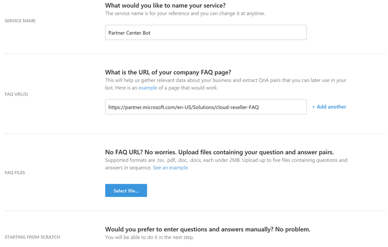
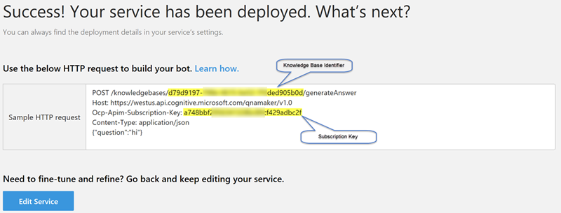
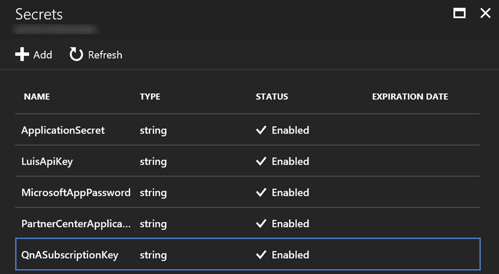

# QnA Maker
Microsoft QnA Maker is a free, easy-to-use, REST API and web-based service 
that trains AI to respond to user's questions in a more natural, 
conversational way. This service has been integrated with the Partner Center 
Bot project in order to provide partners, customers, and users a way to find the
answer to commonly asked questions. If you would like to learn more about this 
service this please check out [QnA Maker Overview](https://www.microsoft.com/cognitive-services/en-us/qnamaker/documentation/home).

The remaining sections of this document will guide you through configuring the 
service for this project.

## Creating New QnA Service
Perform the following in order to create a new instnace of the QnA service

1. Browse to https://qnamaker.ai/ and login using an appropriate account
2. Click the _Create new service_ link found at the top of the page
3. Complete the form as necessary

    

4. Click the _Create_ button at the bottom of the page to create the service
5. Make any necessary modifications to the knowledge question and answer pairs
6. Click the _Save and retrain_ button to apply any changes you made and then click the _Publish_ button
7. Click the _Publish_ button and then document the knowledge base identifier and subscription key

    

## Configuring Partner Center Bot
This project requires that two configurations be configured in order to properly integrate with the 
QnA service. First you will need to update the web.config

```xml
<!-- Specify the QnA knowledge base identifier here -->
<add key="QnAKnowledgebaseId" value="" />
```

The second configuration is for the subscription key. It is recommended that you store this value in an 
instance of Azure Key Vault. If the integration with Azure Key Vault is configured then create a secret 
with the name of _QnASubscriptionKey_



Otherwise you will need to add a new configurations to the web.config that is similar to the following 

```xml
<!-- Specify the QnA subscription key here -->
<add key="QnASubscriptionKey" value="" />
```